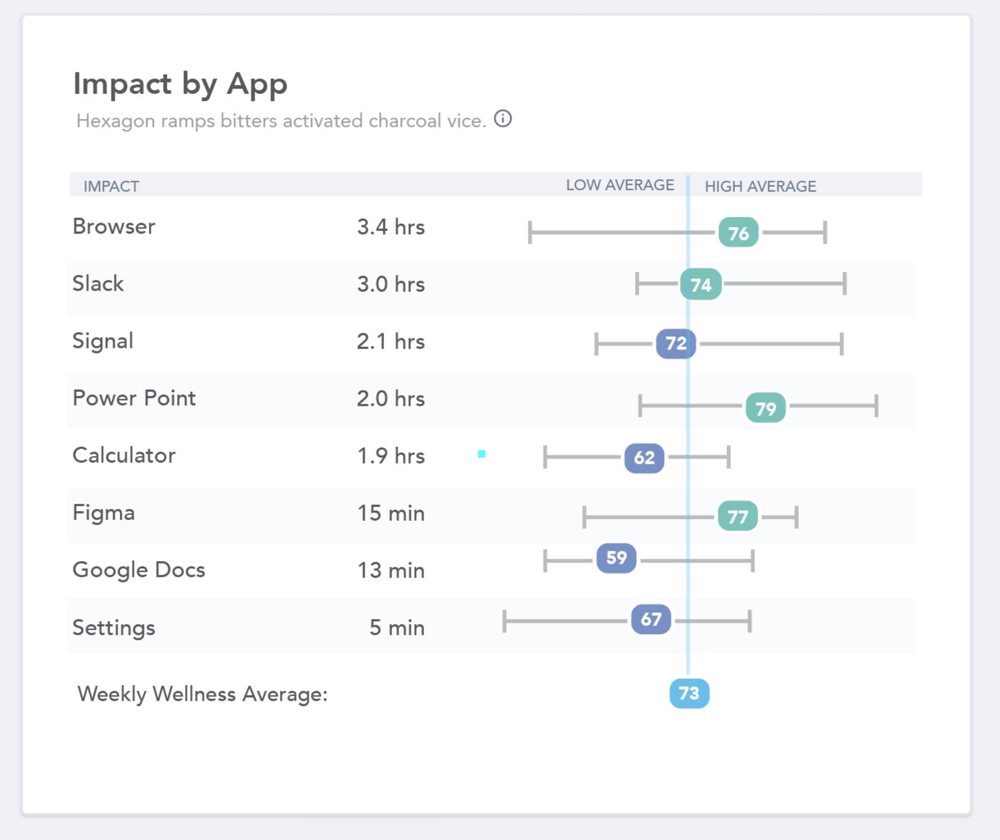

# impact-graph

## What?

It's a Vue component which emulates the following design:

## Where?

This follows the Container/View pattern where data is fed in through [App.vue](https://github.com/yevbar/misu-impact-table/blob/master/src/App.vue) and resulting data is rendered in [ImpactResults.vue](https://github.com/yevbar/misu-impact-table/blob/master/src/components/ImpactResults.vue). The resulting table is an SVG element with a viewBox attribute for scaling purposes (resizing either container or window will keep content at same relative scale) - the benefits being that, first, rectangles and shapes are drawn exactly as desired and, secondly, responsiveness is almost intrinsic because of SVG 'magic'

## Running locally

This project was built using vue's CLI so a simple `yarn serve` should do the trick
